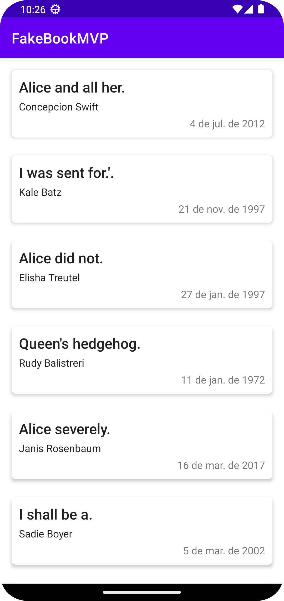

# FakeBookMVP
> Projeto de estudo sobre a arquitetura MVP e sobre o uso da biblioteca RXJava

Principais características desse projeto 

- Padrão de arquitetura Clean Archicture e MVP
- Version Catalog (Gradle) e Kotlin DSL
- Injeção de Dependência
- Uso de módulos para determinados contextos
- Testes Unitários
- Relatório de testes unitários

As principais libraries utilizadas no projeto:

- RXJava e RXAndroid
- Retrofit
- Koin
- Mockk
- Jacoco

# Tela
|                   |
| --------------------------------------------- | 

